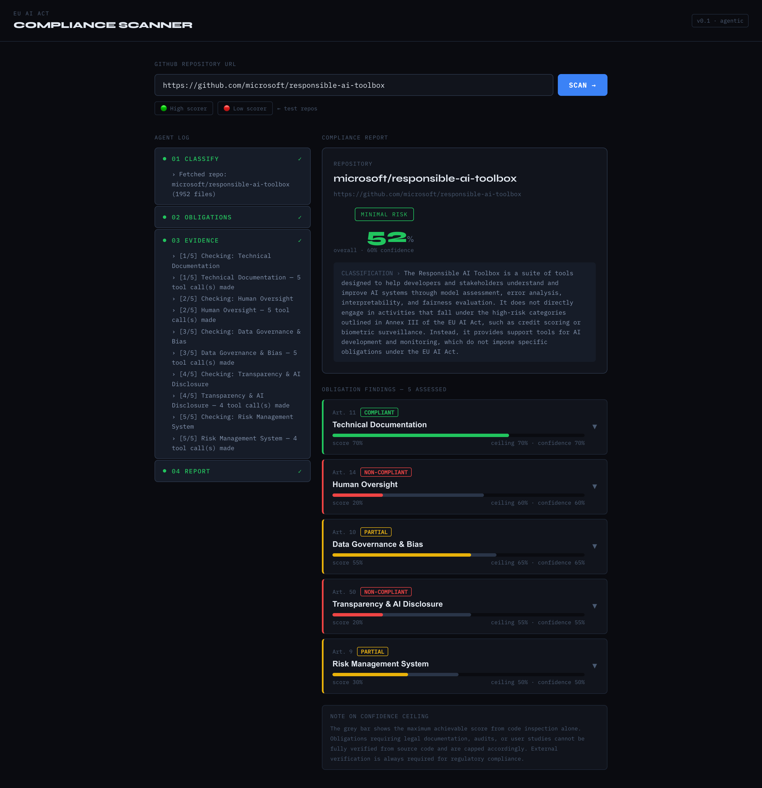

# EU AI Act Compliance Scanner

An agentic pipeline that analyses GitHub repositories against EU AI Act obligations,
classifies risk tier, gathers code evidence, and produces a confidence-aware compliance report.

## Architecture

```
User pastes GitHub URL
        │
        ▼
FastAPI backend (Python)
  ├── Step 1: Classify risk tier          ← Agent reads README + file tree
  ├── Step 2: Generate obligation map     ← Agent selects 5 tenets + signal mapping
  ├── Step 3: Gather evidence             ← GitHub API tool calls + Model interprets
  └── Step 4: Generate report             ← Agent synthesises scored findings
        │
        ▼  (SSE stream)
React frontend
  ├── Live agent log (steps as they happen)
  └── Final compliance report with confidence bars
```

---

## Prerequisites

| Tool | Version | Check |
|------|---------|-------|
| Python | 3.11+ | `python --version` |
| Node.js | 18+ | `node --version` |
| npm | 9+ | `npm --version` |

You will also need:
- **Anthropic/OpenAI API key** 
- **GitHub Personal Access Token** — https://github.com/settings/tokens
  - Scopes needed: `public_repo` (read-only is fine for public repos)

---
## Sample Results from previous Runs for reference:

## Setup

### 1. Clone / extract the project

```bash
cd complianceScanner
```

### 2. Backend setup

```bash
cd backend

# Create a virtual environment
python -m venv venv

# Activate it
# macOS/Linux:
source venv/bin/activate
# Windows (PowerShell):
.\venv\Scripts\Activate.ps1

# Install dependencies
pip install -r requirements.txt

# Create your .env file
cp .env.example .env
```

Open `.env` and fill in your keys:

```env
ANTHROPIC_API_KEY=sk...
GITHUB_PAT=ghp_...
```

### 3. Frontend setup

```bash
# From the project root:
cd frontend
npm install
```

---

## Running

You need **two terminals** running simultaneously.

### Terminal 1 — Backend

```bash
cd backend
source venv/bin/activate   # or .\venv\Scripts\Activate.ps1 on Windows
uvicorn app.main:app --reload --port 8000
```

You should see:
```
INFO:     Uvicorn running on port 8000
INFO:     Started reloader process
```

Verify it's healthy:
```bash
curl http://localhost:8000/health
# → {"status":"ok"}
```

### Terminal 2 — Frontend

```bash
cd frontend
npm run dev
```

You should see:
```
  VITE v5.x.x  ready in Xms
  ➜  Local:   http://localhost:5173/
```

Open **http://localhost:5173** in your browser.

---

## Usage

1. Paste any GitHub repository URL into the input field
2. Click **SCAN →** or press Enter
3. Watch the agent log on the left as each step completes in real time
4. The compliance report appears on the right when done

### Test repos (pre-loaded as quick-fill buttons)

| Repo | Expected score | Why |
|------|---------------|-----|
| `microsoft/responsible-ai-toolbox` | ~75–85% | Explicit fairness tooling, extensive docs, human oversight by design |


---

## Project structure

```
complianceScanner/
├── backend/
│   ├── app/
│   │   ├── main.py              ← FastAPI app + CORS
│   │   ├── agent/
│   │   │   └── pipeline.py      ← The 4-step ReAct agent loop
│   │   ├── models/
│   │   │   └── schemas.py       ← Pydantic models for all data shapes
│   │   ├── routers/
│   │   │   └── analyse.py       ← POST /api/analyse → SSE stream
│   │   └── tools/
│   │       └── github_tool.py   ← GitHub REST API wrapper
│   ├── requirements.txt
│   └── .env.example
└── frontend/
    ├── src/
    │   ├── App.jsx              ← Main layout + input
    │   ├── hooks/
    │   │   └── usePipeline.js   ← SSE consumer + state machine
    │   └── components/
    │       ├── StepLog.jsx      ← Live agent reasoning display
    │       └── ComplianceReport.jsx  ← Scored report with expandable findings
    ├── index.html
    ├── package.json
    └── vite.config.js
```

---

